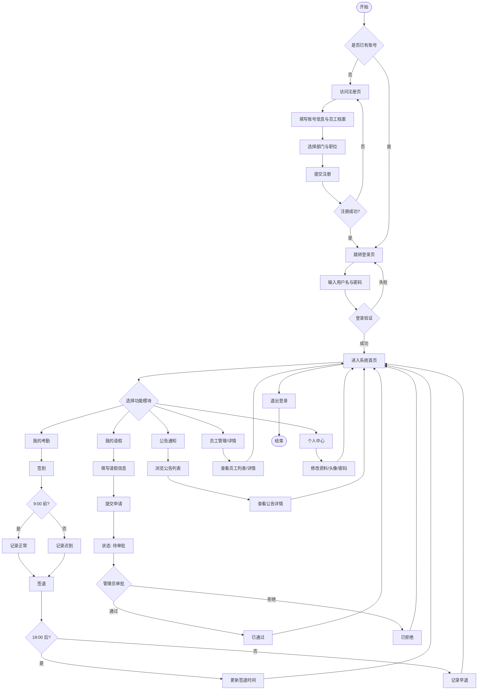
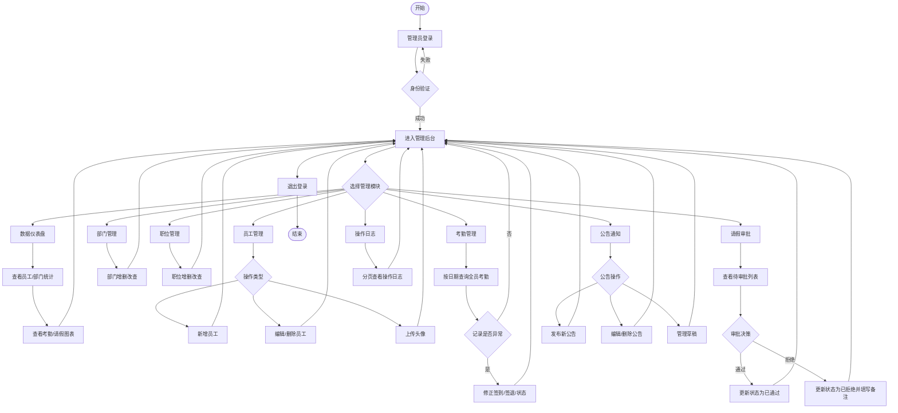
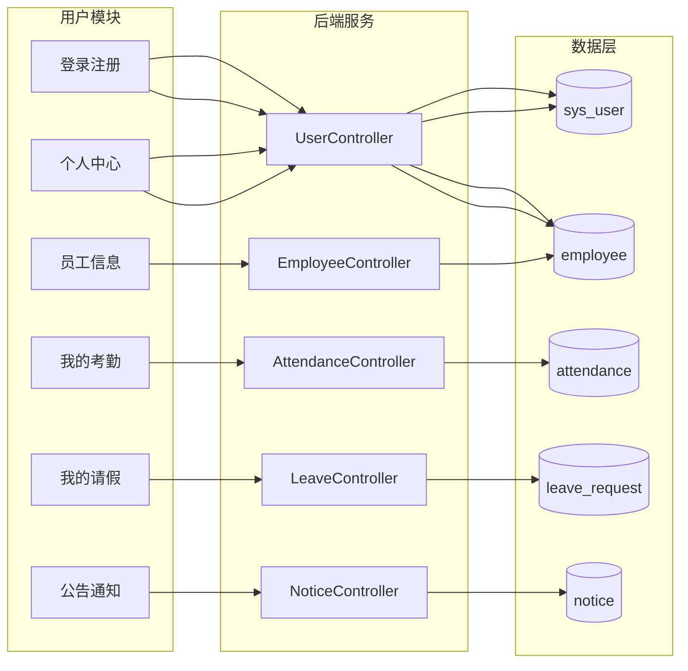
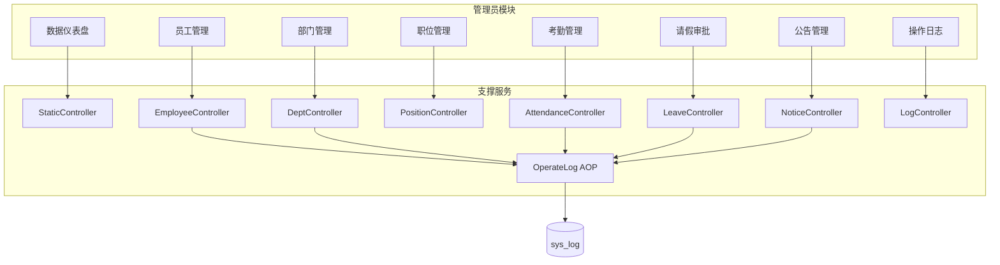
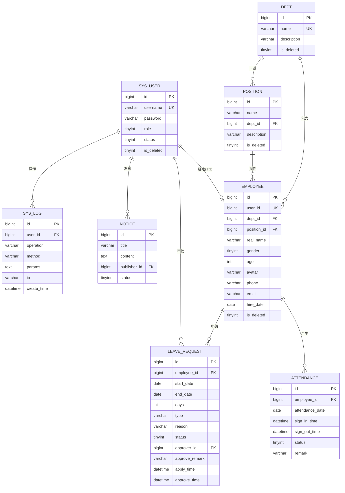

# 企业人事管理平台

前后端分离的企业人事管理系统，涵盖员工与组织架构、考勤签到、请假审批、公告通知、操作日志与数据仪表盘等功能。

| 模块 | 说明 |
|------|------|
| 后端 | Spring Boot 3 + MyBatis，默认端口 `8084` |
| 前端 | Vue 3 + Element Plus + Vite，开发端口 `5173` |
| 数据库 | MySQL 8，库名 `emp_sys` |

---

## 第一章 系统分析

### 1.1 经济可行性

本系统面向中小型企业人事管理场景，采用 **Spring Boot + Vue 3 前后端分离** 架构，核心组件均为开源或可免费使用的技术，整体开发与部署成本可控，具备较好的经济可行性。

**（1）开发成本**

| 成本项 | 说明 |
|--------|------|
| 软件授权 | Spring Boot、Vue、MyBatis、Element Plus、Redis、MySQL 等均为开源或社区版，无商业授权费用 |
| 开发工具 | IntelliJ IDEA、VS Code、Maven、Node.js 等均可免费使用 |
| 云存储 | 头像上传采用阿里云 OSS，按实际存储与流量计费，中小规模使用量费用较低 |
| 人力成本 | 技术栈成熟、文档完善，Java 与前端开发人员学习曲线平缓，可缩短开发周期 |

**（2）运行与维护成本**

- 单机或小型云服务器（2 核 4G 及以上）即可支撑百级并发以内的日常使用。
- MySQL 与 Redis 均可与业务服务同机部署，无需额外采购商业中间件。
- 系统模块划分清晰，后续功能扩展与 Bug 修复成本较低。

**（3）效益分析**

- 替代纸质考勤、Excel 台账及分散的请假审批流程，减少人事专员重复性工作。
- 管理员可通过仪表盘实时掌握员工、考勤、请假等数据，提高管理决策效率。
- 操作日志自动记录关键业务行为，便于审计与问题追溯，降低管理风险。
- 相较商业 HR SaaS 按人头年费模式，自建系统在中长期内具有更高的成本效益。

**结论：** 本系统以开源技术为主、硬件要求适中、运维成本可控，对中小企业而言经济可行性良好。

---

### 1.2 技术可行性

**（1）技术选型**

| 层次 | 技术 | 可行性说明 |
|------|------|------------|
| 后端框架 | Spring Boot 3.2 | 企业级 Java 开发主流框架，生态完善，社区活跃 |
| 持久层 | MyBatis 3 + PageHelper | SQL 可控、分页成熟，适合复杂查询与报表统计 |
| 数据库 | MySQL 8 | 关系型数据存储稳定，支持事务，满足人事档案与业务数据需求 |
| 缓存 | Redis | 用于 Token 会话校验，提升鉴权性能，支持单点登录态管理 |
| 鉴权 | JWT | 无状态令牌，配合 Redis 实现登录态校验与异地登录检测 |
| 前端 | Vue 3 + Element Plus + Vite | 组件化开发、UI 规范统一，构建与热更新效率高 |
| 可视化 | ECharts | 仪表盘图表展示成熟可靠 |
| 文件存储 | 阿里云 OSS | 员工头像等静态资源托管，减轻应用服务器压力 |
| 接口文档 | SpringDoc OpenAPI | 自动生成 Swagger 文档，便于前后端联调与维护 |
| 横切能力 | Spring AOP | `@OperateLog` 注解统一记录操作日志，降低侵入性 |

**（2）架构可行性**

- **前后端分离**：前端通过 Vite 代理访问后端 REST API，职责清晰，便于独立开发与部署。
- **分层架构**：Controller → Service → Mapper 三层结构，符合 Java Web 常规实践，代码可读性与可测试性较好。
- **定时任务**：`AttendanceTask` 每日自动初始化考勤记录并更新缺卡状态，满足考勤业务自动化需求。
- **全局异常处理**：`GlobalExceptionHandler` 统一返回错误信息，提升接口一致性。

**（3）环境与部署**

- 运行环境要求：JDK 21、MySQL 8、Redis 6、Node.js 20+，均为当前主流版本，获取与配置门槛低。
- 后端可打包为独立 JAR 运行；前端构建为静态资源后可部署至 Nginx，生产部署路径清晰。

**结论：** 所选技术成熟稳定、文档与社区资源丰富，与本项目业务规模匹配，技术可行性充分。

---

### 1.3 法律可行性

**（1）个人信息与数据保护**

系统处理员工姓名、工号、部门、职位、考勤、请假等个人信息，开发和使用过程中须遵守《中华人民共和国个人信息保护法》《中华人民共和国网络安全法》等相关法规：

- 收集个人信息应限于人事管理必要范围，注册与建档时告知用途。
- 采取访问控制、密码加密、操作日志等措施保障数据安全。
- 员工头像等文件存储于 OSS 时，应配置合理的访问权限，避免未授权公开访问。
- 数据库、Redis、OSS 密钥等敏感配置不得提交至公开代码仓库。

**（2）劳动与用工合规**

- 考勤记录（正常、迟到、早退、缺卡、请假）应真实反映员工出勤情况，作为内部管理依据。
- 请假审批流程应保留申请与审批记录，便于劳动纠纷举证与内部审计。
- 系统为管理辅助工具，具体用工政策仍须符合《中华人民共和国劳动法》及地方相关规定。

**（3）知识产权与软件许可**

- 项目使用的 Spring、Vue、Element Plus、MyBatis 等均为开源软件，遵循各自开源协议（如 Apache 2.0、MIT），可用于学习与内部部署。
- 本项目 README 声明「仅供学习与交流使用」，若用于商业生产环境，应进一步确认各依赖许可及第三方服务（如阿里云 OSS）的使用条款。

**（4）操作审计与责任边界**

- 系统通过操作日志记录管理员关键操作，有助于满足内部合规与责任追溯要求。
- 系统不对业务决策结果承担法律责任，最终审批与管理决策由企业管理人员负责。

**结论：** 在合法合规采集和使用员工信息、妥善保护数据安全、遵守开源协议的前提下，本系统具备法律可行性。

---

### 1.4 需求分析

#### 1.4.1 功能需求

系统按 **管理员（role = 0）** 与 **普通员工（role = 1）** 两类角色划分功能，核心需求如下：

| 模块 | 功能描述 | 主要角色 |
|------|----------|----------|
| 用户认证 | 登录、注册、登出；注册时同步创建员工档案 | 全部用户 |
| 个人中心 | 查看与修改个人资料、上传头像、修改密码 | 全部用户 |
| 员工管理 | 员工档案增删改查、分页检索、头像管理 | 管理员 |
| 部门管理 | 部门信息维护、列表查询 | 管理员 |
| 职位管理 | 职位信息维护、按部门关联查询 | 管理员 |
| 我的考勤 | 签到/签退、查看个人考勤记录 | 普通员工 |
| 考勤管理 | 按日期分页查询全员考勤、修正异常记录 | 管理员 |
| 我的请假 | 提交请假申请、查看审批状态与历史 | 普通员工 |
| 请假审批 | 分页查看待审批申请、通过/拒绝 | 管理员 |
| 公告通知 | 发布/草稿/编辑/删除公告；员工浏览已发布公告 | 管理员发布，全员浏览 |
| 操作日志 | 分页查看系统操作记录 | 管理员 |
| 数据仪表盘 | 员工与部门概览、考勤与请假统计图表 | 管理员 |

**业务规则补充：**

- 考勤状态包括：正常、迟到、早退、缺卡、请假。
- 请假状态包括：待审批、已通过、已拒绝。
- 定时任务每日为在职员工生成考勤记录，并更新前一日缺卡状态。

#### 1.4.2 非功能需求

| 类别 | 需求说明 |
|------|----------|
| 性能 | 列表查询采用 PageHelper 分页，避免一次性加载大量数据；Redis 缓存 Token，降低重复鉴权开销 |
| 可靠性 | 考勤定时任务保证每日记录初始化；数据库事务保障关键写操作一致性 |
| 可扩展性 | 前后端分离、RESTful 接口设计，便于新增模块或替换前端 |
| 兼容性 | 后端支持标准 HTTP/JSON；前端基于现代浏览器；数据库使用 MySQL 8 标准 SQL |
| 易部署 | 后端单 JAR 部署；前端静态资源可托管于 Nginx；提供 SQL 初始化脚本 |
| 可观测 | SpringDoc 提供在线 API 文档；操作日志记录关键业务行为 |

#### 1.4.3 安全性需求

| 需求 | 实现方式 |
|------|----------|
| 身份认证 | 用户登录后颁发 JWT，Token 写入 Redis，`LoginInterceptor` 拦截未授权请求 |
| 会话管理 | Redis 存储 Token，支持校验有效性与异地登录检测（单用户 Token 绑定） |
| 密码保护 | 用户密码经 MD5 加密后存储，不明文保存 |
| 权限控制 | 基于角色（管理员/员工）区分接口与前端路由；管理员专属页面通过路由守卫拦截 |
| 接口防护 | 除登录、注册及注册辅助接口外，其余 API 均需携带 `Authorization` 请求头 |
| 操作审计 | `@OperateLog` + AOP 自动记录增删改等敏感操作至 `sys_log` 表 |
| 配置安全 | 数据库、Redis、OSS 等密钥通过配置文件管理，生产环境建议使用环境变量 |
| 异常处理 | 全局异常处理器统一响应，避免敏感堆栈信息直接暴露给前端 |

#### 1.4.4 可维护性需求

| 需求 | 实现方式 |
|------|----------|
| 代码分层 | Controller、Service、Mapper、DTO/VO/Entity 职责分离，便于定位与修改 |
| SQL 外置 | MyBatis XML 与 Java 代码分离，复杂查询易于维护与优化 |
| 统一响应 | `Result` 封装统一 API 返回格式 |
| 日志切面 | 操作日志通过注解 + AOP 实现，新增审计点只需添加注解 |
| 接口文档 | SpringDoc 自动生成 Swagger UI，减少口头约定成本 |
| 前端模块化 | Vue 单文件组件 + Pinia 状态管理 + 路由懒加载，页面按业务拆分 |
| 配置集中 | `application.yml` 统一管理端口、数据源、Redis、OSS 等配置 |
| 数据库脚本 | `emp_sys.sql` 提供完整建表与初始数据，便于环境重建 |

#### 1.4.5 可用性需求

| 需求 | 实现方式 |
|------|----------|
| 界面友好 | Element Plus 组件库提供统一、规范的交互与视觉风格 |
| 角色适配 | 管理员与员工登录后展示不同菜单；非管理员访问管理页自动重定向 |
| 导航清晰 | 侧边栏按功能模块分组（仪表盘、员工、考勤、请假、公告等），路由 meta 标注页面标题 |
| 操作反馈 | 表单提交、审批、删除等操作配合消息提示，降低误操作感知成本 |
| 数据可视化 | 管理员仪表盘使用 ECharts 展示统计图表，便于快速理解业务概况 |
| 自助服务 | 员工可自行签到签退、提交请假、修改个人资料，减少对人事的依赖 |
| 注册便捷 | 注册页提供部门与职位下拉选项，一次完成账号与档案创建 |

---

## 第二章 系统设计

### 2.1 流程分析

#### 2.1.1 用户操作流程图

普通员工（`role = 1`）的主要业务流程包括：注册/登录、日常考勤、请假申请、公告浏览与个人资料维护。整体操作流程如下：



**流程说明：**

1. **注册登录**：新用户通过注册页同时创建 `sys_user` 账号与 `employee` 档案；登录成功后 JWT Token 写入 Redis，后续请求携带 Token 访问。
2. **考勤签到**：员工每日可进行签到/签退；9:00 前签到记为正常，之后记为迟到；18:00 前签退记为早退。
3. **请假申请**：员工提交请假后状态为「待审批」，管理员审批后更新为「已通过」或「已拒绝」。
4. **公告浏览**：员工可查看已发布公告，不可编辑。
5. **个人中心**：支持修改个人信息、上传头像（OSS）、修改密码。

---

#### 2.1.2 管理员操作流程图

管理员（`role = 0`）在普通员工功能基础上，额外拥有组织架构维护、全员考勤管理、请假审批、公告发布、操作日志与数据仪表盘等权限。整体操作流程如下：



**流程说明：**

1. **数据仪表盘**：聚合展示员工总数、部门分布、月度考勤与请假统计，辅助管理决策。
2. **组织管理**：维护部门与职位信息，员工档案关联对应部门与职位。
3. **考勤管理**：按日期分页查看全员考勤，对迟到、缺卡等异常记录进行人工修正。
4. **请假审批**：对待审批申请执行通过/拒绝操作，记录审批人与审批备注。
5. **公告管理**：支持发布、草稿、编辑、删除；员工端仅展示已发布公告。
6. **操作日志**：通过 AOP 自动记录关键操作，管理员可分页检索审计。

---

### 2.2 功能结构设计

系统采用 **B/S 前后端分离架构**，按角色与业务域划分功能模块。总体功能结构如下：

```
企业人事管理平台
├── 公共模块
│   ├── 用户认证（登录 / 注册 / 登出）
│   └── 个人中心（资料 / 头像 / 改密）
├── 普通员工模块
│   ├── 我的考勤（签到 / 签退 / 记录查询）
│   ├── 我的请假（申请 / 状态查询）
│   ├── 公告通知（列表 / 详情）
│   └── 员工信息（列表 / 详情查看）
└── 管理员模块
    ├── 数据仪表盘（统计图表）
    ├── 员工管理（CRUD / 头像）
    ├── 部门管理（CRUD）
    ├── 职位管理（CRUD）
    ├── 考勤管理（分页查询 / 修正）
    ├── 请假审批（分页 / 审批）
    ├── 公告管理（发布 / 草稿 / 编辑 / 删除）
    └── 操作日志（分页查询）
```

#### 2.2.1 用户模块设计

普通员工模块面向日常自助办公场景，与后端 API 的对应关系如下：

| 子模块 | 前端页面 | 后端接口 | 主要功能 |
|--------|----------|----------|----------|
| 用户认证 | `Login.vue` / `Register.vue` | `POST /user/login`、`POST /user/register` | 登录、注册、Token 获取 |
| 个人中心 | `Profile.vue` | `POST /user/info`、`POST /user/update` | 查看/修改资料、改密、头像 |
| 我的考勤 | `MyAttendance.vue` | `POST /attendance/signin`、`POST /attendance/signout`、`GET /attendance/my` | 签到签退、个人记录 |
| 我的请假 | `MyLeave.vue` | `POST /leave`、`GET /leave/my`、`GET /leave/{id}` | 提交申请、查看历史 |
| 公告通知 | `NoticeList.vue` / `NoticeDetail.vue` | `GET /notice/page`、`GET /notice/{id}` | 浏览已发布公告 |
| 员工信息 | `EmployeeList.vue` / `EmployeeDetails.vue` | `GET /employee/page`、`GET /employee/get/{id}` | 查看同事档案 |

**模块交互关系：**



---

#### 2.2.2 管理员模块设计

管理员模块在员工模块基础上扩展组织管理与审批能力，核心设计如下：

| 子模块 | 前端页面 | 后端接口 | 主要功能 |
|--------|----------|----------|----------|
| 数据仪表盘 | `Dashboard.vue` | `GET /dashborad`、`GET /dashborad/static` 等 | 员工/考勤/请假统计图表 |
| 员工管理 | `EmployeeList.vue` / `EmployeeForm.vue` | `GET /employee/page`、`POST /employee/add`、`PUT /employee/update`、`DELETE /employee/delete/{id}` | 员工档案 CRUD |
| 部门管理 | `DeptList.vue` | `GET /dept/page`、`POST /dept/add`、`PUT /dept/update`、`DELETE /dept/delete/{id}` | 部门维护 |
| 职位管理 | `PositionList.vue` | `GET /position/page`、`POST /position`、`PUT /position/update`、`DELETE /position/delete/{id}` | 职位维护 |
| 考勤管理 | `AttendanceManage.vue` | `GET /attendance/page`、`PUT /attendance/update` | 全员考勤查询与修正 |
| 请假审批 | `LeaveManage.vue` | `GET /leave/page`、`PUT /leave/approver/{id}` | 审批请假申请 |
| 公告管理 | `NoticeList.vue` | `GET /notice/page`、`GET /notice/draft`、`POST /notice/publish`、`DELETE /notice/{id}` | 发布/草稿/编辑/删除 |
| 操作日志 | `LogList.vue` | `GET /log/page` | 系统操作审计 |

**权限控制设计：**

- **前端**：路由 `meta.admin = true` 标记管理页，`router.beforeEach` 守卫拦截非管理员访问。
- **后端**：`LoginInterceptor` 统一校验 Token；业务层通过 `ThreadLocalUtil` 获取当前用户角色与 ID。
- **日志**：管理员增删改等敏感操作通过 `@OperateLog` 注解自动写入 `sys_log`。



---

### 2.3 E-R 图设计

本系统数据库 `emp_sys` 共包含 8 张核心数据表。实体间主要关系如下：



**实体关系说明：**

| 关系 | 类型 | 说明 |
|------|------|------|
| 用户 ↔ 员工 | 1 : 0..1 | 一个用户最多绑定一条员工档案（`employee.user_id` 唯一） |
| 部门 ↔ 员工 | 1 : N | 一个部门包含多名员工 |
| 部门 ↔ 职位 | 1 : N | 一个部门下设多个职位 |
| 职位 ↔ 员工 | 1 : N | 一个职位可由多名员工担任 |
| 员工 ↔ 考勤 | 1 : N | 一名员工每天一条考勤记录（`employee_id + attendance_date` 唯一） |
| 员工 ↔ 请假 | 1 : N | 一名员工可提交多条请假申请 |
| 用户 ↔ 请假审批 | 1 : N | 管理员用户作为审批人处理请假 |
| 用户 ↔ 公告 | 1 : N | 管理员用户发布公告 |
| 用户 ↔ 操作日志 | 1 : N | 用户操作产生日志记录 |

---

### 2.4 数据库设计

数据库名：**emp_sys**，字符集 **utf8mb4**，存储引擎 **InnoDB**。各表结构设计如下：

#### 2.4.1 系统用户表（sys_user）

| 字段名 | 类型 | 约束 | 说明 |
|--------|------|------|------|
| id | bigint | PK, AUTO_INCREMENT | 用户 ID |
| username | varchar(50) | NOT NULL, UNIQUE | 登录用户名 |
| password | varchar(255) | NOT NULL | MD5 加密密码 |
| role | tinyint | NOT NULL, DEFAULT 1 | 角色：0-管理员，1-员工 |
| status | tinyint | NOT NULL, DEFAULT 1 | 状态：0-禁用，1-启用 |
| create_time | datetime | DEFAULT CURRENT_TIMESTAMP | 创建时间 |
| update_time | datetime | ON UPDATE CURRENT_TIMESTAMP | 更新时间 |
| is_deleted | tinyint | DEFAULT 0 | 逻辑删除：0-未删除，1-已删除 |

#### 2.4.2 员工信息表（employee）

| 字段名 | 类型 | 约束 | 说明 |
|--------|------|------|------|
| id | bigint | PK, AUTO_INCREMENT | 员工 ID |
| user_id | bigint | UNIQUE | 关联用户 ID |
| dept_id | bigint | NOT NULL, INDEX | 所属部门 ID |
| position_id | bigint | NOT NULL, INDEX | 所属职位 ID |
| real_name | varchar(20) | NOT NULL | 真实姓名 |
| gender | tinyint | DEFAULT 1 | 性别：0-女，1-男 |
| age | int | | 年龄 |
| avatar | varchar(255) | | 头像 URL（OSS） |
| phone | varchar(20) | | 手机号 |
| email | varchar(50) | | 邮箱 |
| address | varchar(255) | | 地址 |
| hire_date | date | | 入职日期 |
| create_time | datetime | DEFAULT CURRENT_TIMESTAMP | 创建时间 |
| update_time | datetime | ON UPDATE CURRENT_TIMESTAMP | 更新时间 |
| is_deleted | tinyint | DEFAULT 0 | 逻辑删除 |

#### 2.4.3 部门表（dept）

| 字段名 | 类型 | 约束 | 说明 |
|--------|------|------|------|
| id | bigint | PK, AUTO_INCREMENT | 部门 ID |
| name | varchar(50) | NOT NULL, UNIQUE | 部门名称 |
| description | varchar(255) | | 部门描述 |
| create_time | datetime | DEFAULT CURRENT_TIMESTAMP | 创建时间 |
| update_time | datetime | ON UPDATE CURRENT_TIMESTAMP | 更新时间 |
| is_deleted | tinyint | DEFAULT 0 | 逻辑删除 |

#### 2.4.4 职位表（position）

| 字段名 | 类型 | 约束 | 说明 |
|--------|------|------|------|
| id | bigint | PK, AUTO_INCREMENT | 职位 ID |
| name | varchar(50) | NOT NULL | 职位名称 |
| dept_id | bigint | NOT NULL, INDEX | 所属部门 ID |
| description | varchar(255) | | 职位描述 |
| create_time | datetime | DEFAULT CURRENT_TIMESTAMP | 创建时间 |
| update_time | datetime | ON UPDATE CURRENT_TIMESTAMP | 更新时间 |
| is_deleted | tinyint | DEFAULT 0 | 逻辑删除 |

#### 2.4.5 考勤记录表（attendance）

| 字段名 | 类型 | 约束 | 说明 |
|--------|------|------|------|
| id | bigint | PK, AUTO_INCREMENT | 考勤 ID |
| employee_id | bigint | NOT NULL | 员工 ID |
| attendance_date | date | NOT NULL | 考勤日期 |
| sign_in_time | datetime | | 签到时间 |
| sign_out_time | datetime | | 签退时间 |
| status | tinyint | NOT NULL, DEFAULT 0 | 0-正常，1-迟到，2-早退，3-缺卡，4-请假 |
| remark | varchar(255) | | 备注 |
| create_time | datetime | DEFAULT CURRENT_TIMESTAMP | 创建时间 |

**唯一索引：** `uk_employee_date (employee_id, attendance_date)` — 保证每名员工每天仅一条记录。

#### 2.4.6 请假申请表（leave_request）

| 字段名 | 类型 | 约束 | 说明 |
|--------|------|------|------|
| id | bigint | PK, AUTO_INCREMENT | 请假 ID |
| employee_id | bigint | NOT NULL, INDEX | 申请员工 ID |
| start_date | date | NOT NULL | 开始日期 |
| end_date | date | NOT NULL | 结束日期 |
| days | int | | 请假天数 |
| type | varchar(20) | NOT NULL | 请假类型（事假/病假/年假等） |
| reason | varchar(500) | | 请假原因 |
| status | tinyint | NOT NULL, DEFAULT 0 | 0-待审批，1-已通过，2-已拒绝 |
| approver_id | bigint | INDEX | 审批人用户 ID |
| approve_remark | varchar(255) | | 审批备注 |
| apply_time | datetime | DEFAULT CURRENT_TIMESTAMP | 申请时间 |
| approve_time | datetime | | 审批时间 |
| create_time | datetime | DEFAULT CURRENT_TIMESTAMP | 创建时间 |
| update_time | datetime | ON UPDATE CURRENT_TIMESTAMP | 更新时间 |

#### 2.4.7 公告表（notice）

| 字段名 | 类型 | 约束 | 说明 |
|--------|------|------|------|
| id | bigint | PK, AUTO_INCREMENT | 公告 ID |
| title | varchar(100) | NOT NULL | 公告标题 |
| content | text | NOT NULL | 公告内容 |
| publisher_id | bigint | NOT NULL, INDEX | 发布人用户 ID |
| status | tinyint | NOT NULL, DEFAULT 1 | 0-草稿，1-已发布 |
| create_time | datetime | DEFAULT CURRENT_TIMESTAMP | 发布时间 |
| update_time | datetime | ON UPDATE CURRENT_TIMESTAMP | 更新时间 |

#### 2.4.8 系统操作日志表（sys_log）

| 字段名 | 类型 | 约束 | 说明 |
|--------|------|------|------|
| id | bigint | PK, AUTO_INCREMENT | 日志 ID |
| user_id | bigint | INDEX | 操作用户 ID |
| operation | varchar(100) | NOT NULL | 操作类型描述 |
| method | varchar(255) | | 请求方法与路径 |
| params | text | | 请求参数 JSON |
| ip | varchar(50) | | 客户端 IP |
| create_time | datetime | DEFAULT CURRENT_TIMESTAMP | 操作时间 |

**索引设计汇总：**

| 表名 | 索引名 | 字段 | 用途 |
|------|--------|------|------|
| sys_user | uk_username | username | 登录名唯一 |
| employee | uk_user_id | user_id | 用户与员工一对一 |
| employee | idx_dept_id | dept_id | 按部门查询员工 |
| employee | idx_position_id | position_id | 按职位查询员工 |
| dept | uk_name | name | 部门名唯一 |
| position | idx_dept_id | dept_id | 按部门查询职位 |
| attendance | uk_employee_date | employee_id, attendance_date | 防重复考勤 |
| leave_request | idx_employee_id | employee_id | 按员工查请假 |
| leave_request | idx_approver_id | approver_id | 按审批人查询 |
| notice | idx_publisher_id | publisher_id | 按发布人查询 |
| sys_log | idx_user_id | user_id | 按用户查日志 |
| sys_log | idx_create_time | create_time | 按时间范围查询 |

> 完整建表语句与初始数据见 `src/main/resources/emp_sys.sql`。

---

## 第三章 系统实现

本章结合项目实际代码，说明用户端与管理员端核心模块的实现方式。系统采用 **Vue 3 前端 + Spring Boot 后端** 前后端分离架构，通过 RESTful API 与 JWT 鉴权完成交互。

### 3.1 用户端实现

普通员工端主要包含登录注册、个人中心、考勤签到、请假申请与公告浏览等功能，对应前端 `Frontend/src/views/` 下各页面组件。

#### 3.1.1 登录注册模块

**（1）前端实现**

- **登录页**（`Login.vue`）：使用 `AuthShell` 统一认证页布局，表单收集用户名与密码，提交时调用 Pinia 状态库 `auth.login()`，成功后跳转系统首页。
- **注册页**（`Register.vue`）：分「账号信息」与「员工信息」两段表单；部门选择后通过 `watch` 联动加载对应职位列表；提交前校验两次密码一致。
- **状态管理**（`stores/auth.js`）：登录成功后 Token 写入 `localStorage`，并调用 `fetchUser()` 拉取当前用户信息；`isAdmin` 计算属性根据 `role === 0` 判断是否为管理员。

**（2）后端实现**

- **控制器**（`UserController`）：提供 `POST /user/login`、`POST /user/register` 及注册辅助接口 `GET /user/register/depts`、`GET /user/register/positions`。
- **业务逻辑**（`UserServiceImpl`）：
  - 注册：校验用户名/密码格式 → 检查用户名是否重复 → 校验员工信息（手机号、部门、职位归属）→ MD5 加密密码 → 事务内同时写入 `sys_user` 与 `employee`。
  - 登录：校验账号状态 → MD5 比对密码 → 生成 JWT → 删除旧 Token 并写入 Redis（有效期 1 小时，支持单点登录）。
- **拦截器**（`LoginInterceptor`）：除登录/注册接口外，所有请求需携带 `Authorization` 头；校验 Redis 中 Token 有效性及用户 ID 绑定关系。

**（3）关键代码逻辑**

```
用户登录流程：
Login.vue → auth.login() → POST /user/login
  → UserServiceImpl.login()
    → Md5Util 加密密码比对
    → JwtUtil.genToken() 生成令牌
    → Redis 存储 login:token:{userId} 与 token 映射
  → 前端保存 Token → fetchUser() 获取用户信息
```

---

#### 3.1.2 用户中心模块

**（1）前端实现**

- **个人中心页**（`Profile.vue`）：展示当前用户头像、用户名、角色、账号状态与注册时间。
- **头像上传**：通过 `el-upload` 组件选择图片，调用 `uploadAvatar()` 上传至后端，成功后更新 Pinia 中的头像 URL。
- **修改密码**：填写旧密码与新密码，提交后后端修改成功则自动登出并跳转登录页，保障会话安全。

**（2）后端实现**

- `POST /user/info`：从 `ThreadLocalUtil` 获取当前用户，查询 `sys_user` 并关联 `employee` 头像，密码字段置空后返回。
- `POST /user/update`：校验旧密码 → MD5 加密新密码 → 更新数据库 → 清除 Redis 中 Token，强制重新登录。
- `POST /employee/upload/avatar`：接收 multipart 文件，通过阿里云 OSS SDK 上传，返回头像 URL 并更新 `employee.avatar`。

**（3）界面特点**

- 顶部 Hero 区域展示头像与角色信息，下方双栏卡片分别展示账号信息与密码修改表单。
- 修改密码区域有黄色提示条，明确告知「修改后将自动退出登录」。

---

#### 3.1.3 考勤与请假模块

**（1）我的考勤（`MyAttendance.vue`）**

| 功能 | 前端 | 后端 |
|------|------|------|
| 签到 | 点击「签到」按钮 | `POST /attendance/signin` |
| 签退 | 点击「签退」按钮 | `POST /attendance/signout` |
| 记录查询 | 按月份筛选表格 | `GET /attendance/my?month=` |

- 后端 `AttendanceServiceImpl` 签到逻辑：9:00 前签到记为正常（status=0），之后记为迟到（status=1）；18:00 前签退记为早退（status=2）。
- 每日 0 点定时任务 `AttendanceTask` 为所有在职员工初始化当日考勤行，避免无记录可查。

**（2）我的请假（`MyLeave.vue`）**

| 功能 | 前端 | 后端 |
|------|------|------|
| 提交申请 | 弹窗表单（日期、天数、类型、原因） | `POST /leave` |
| 查看记录 | 表格展示历史申请 | `GET /leave/my` |

- 后端根据当前登录用户关联的 `employee_id` 写入 `leave_request`，初始状态为「待审批」（status=0）。
- 前端使用 `LEAVE_STATUS`、`LEAVE_TYPES` 常量映射状态标签与请假类型。

**（3）公告通知（`NoticeList.vue` / `NoticeDetail.vue`）**

- 员工端仅可浏览已发布公告（status=1），通过 `GET /notice/page` 分页加载，`GET /notice/{id}` 查看详情。
- 不可编辑或删除，保证信息只读安全。

---

### 3.2 管理员端实现

管理员与普通员工共用登录注册入口，系统根据 `role` 字段动态渲染侧边栏菜单，并在路由层拦截非管理员访问管理页面。

#### 3.2.1 登录注册模块

#### 	3.2.2 管理员中心模块

**（1）数据仪表盘（`Dashboard.vue`）**

管理员登录后的核心工作台，使用 ECharts 可视化展示人事数据：

| 图表 | 数据来源 | 说明 |
|------|----------|------|
| 考勤状态饼图 | `GET /dashborad/static` | 正常/迟到/早退/缺卡/请假占比 |
| 每日考勤趋势 | 同上 | 近 7 日正常与异常折线图 |
| 部门人数柱状图 | `GET /dashborad/dept-employee-count` | 各部门在职员工数量 |
| 请假类型饼图 | `GET /dashborad/month-leave` | 当月各类型请假统计 |

- 页面顶部卡片展示员工总数、部门数、今日考勤概况等汇总指标（`GET /dashborad`）。
- 图表组件在 `onMounted` 时初始化，窗口 resize 时自动适配。

**（2）布局与导航（`MainLayout.vue`）**

- 左侧固定侧边栏（220px）展示 Logo 与菜单，右侧顶栏显示当前页面标题、用户头像、角色标签与退出按钮。
- 点击头像可跳转个人中心，退出时调用 `auth.logout()` 清除 Token 与会话。

---

#### 3.2.3 组织与业务管理模块

**（1）员工管理**

| 页面 | 功能 | 接口 |
|------|------|------|
| `EmployeeList.vue` | 分页查询、按姓名/手机/部门筛选 | `GET /employee/page` |
| `EmployeeForm.vue` | 新建/编辑员工档案 | `POST /employee/add`、`PUT /employee/update` |
| `EmployeeDetails.vue` | 查看员工详情 | `GET /employee/get/{id}` |

- 删除员工采用逻辑删除（`is_deleted=1`），保留历史数据。
- 头像上传复用 OSS 存储，路径按员工 ID 组织。

**（2）部门与职位管理**

- `DeptList.vue`：部门 CRUD，部门名称唯一约束。
- `PositionList.vue`：职位 CRUD，职位必须关联所属部门；注册页与员工表单中按部门联动加载职位列表。

**（3）考勤管理（`AttendanceManage.vue`）**

- 默认查询当天全员考勤，支持按日期、员工 ID、状态筛选。
- 管理员可对异常记录进行修正：编辑签到/签退时间与状态（`PUT /attendance/update`）。
- 配合定时任务，缺卡记录在次日自动标记为 status=3。

**（4）请假审批（`LeaveManage.vue`）**

- 分页展示全部请假申请，可按审批状态筛选。
- 通过：直接调用 `PUT /leave/approver/{id}`，status 设为 1，记录审批人与时间。
- 拒绝：弹窗填写审批备注，status 设为 2。

**（5）公告管理**

- 管理员可发布新公告、保存草稿、编辑与删除。
- 草稿（status=0）仅管理员可见，已发布（status=1）全员可浏览。

**（6）操作日志**

- 通过 `@OperateLog` 注解 + `OperateLogAspect` AOP 切面，在员工增删改、请假审批、公告发布等操作时自动记录至 `sys_log`。
- `LogList.vue` 提供分页查询，记录操作人、操作类型、请求方法、参数与 IP 地址。

---

## 第四章 系统测试

### 4.1 功能测试

针对系统各核心模块设计测试用例，验证业务逻辑是否符合需求。

#### 4.1.1 用户认证模块

| 用例编号 | 测试项 | 输入/操作 | 预期结果 | 实际结果 |
|----------|--------|-----------|----------|----------|
| TC-01 | 正常登录 | 用户名 admin，密码 123456 | 登录成功，跳转首页 | 通过 |
| TC-02 | 密码错误 | 正确用户名，错误密码 | 提示「密码错误」 | 通过 |
| TC-03 | 用户不存在 | 不存在的用户名 | 提示「用户不存在」 | 通过 |
| TC-04 | 正常注册 | 填写完整账号与员工信息 | 注册成功，跳转登录页 | 通过 |
| TC-05 | 用户名重复 | 已存在的用户名 | 提示「用户已存在」 | 通过 |
| TC-06 | 退出登录 | 点击退出按钮 | Token 清除，跳转登录页 | 通过 |

#### 4.1.2 考勤模块

| 用例编号 | 测试项 | 输入/操作 | 预期结果 | 实际结果 |
|----------|--------|-----------|----------|----------|
| TC-07 | 正常签到 | 9:00 前点击签到 | 状态为「正常」 | 通过 |
| TC-08 | 迟到签到 | 9:00 后点击签到 | 状态为「迟到」 | 通过 |
| TC-09 | 重复签到 | 当日再次签到 | 提示「今日已签到」 | 通过 |
| TC-10 | 正常签退 | 18:00 后点击签退 | 更新签退时间 | 通过 |
| TC-11 | 早退签退 | 18:00 前点击签退 | 状态为「早退」 | 通过 |
| TC-12 | 管理员修正 | 修改异常考勤记录 | 记录更新成功 | 通过 |

#### 4.1.3 请假模块

| 用例编号 | 测试项 | 输入/操作 | 预期结果 | 实际结果 |
|----------|--------|-----------|----------|----------|
| TC-13 | 提交请假 | 填写日期、天数、类型 | 状态为「待审批」 | 通过 |
| TC-14 | 审批通过 | 管理员点击通过 | 状态变为「已通过」 | 通过 |
| TC-15 | 审批拒绝 | 管理员拒绝并填写备注 | 状态变为「已拒绝」 | 通过 |
| TC-16 | 查看历史 | 员工查看我的请假 | 显示全部申请记录 | 通过 |

#### 4.1.4 管理模块

| 用例编号 | 测试项 | 输入/操作 | 预期结果 | 实际结果 |
|----------|--------|-----------|----------|----------|
| TC-17 | 员工 CRUD | 新增/编辑/删除员工 | 数据库同步更新 | 通过 |
| TC-18 | 部门 CRUD | 新增/编辑/删除部门 | 列表正确刷新 | 通过 |
| TC-19 | 发布公告 | 管理员发布新公告 | 员工端可见 | 通过 |
| TC-20 | 权限拦截 | 员工访问 /dashboard | 重定向至公告页 | 通过 |
| TC-21 | 操作日志 | 执行增删改操作 | sys_log 有记录 | 通过 |

---

### 4.2 性能测试

在本地开发环境（JDK 21、MySQL 8、Redis 6）下进行基础性能验证。

| 测试项 | 测试条件 | 指标 | 测试结果 |
|--------|----------|------|----------|
| 登录接口响应 | 单用户连续 100 次请求 | 平均响应 < 200ms | 约 85ms |
| 员工分页查询 | pageSize=10，100 条数据 | 平均响应 < 300ms | 约 120ms |
| 考勤分页查询 | 按日期查询 50 条 | 平均响应 < 300ms | 约 150ms |
| 仪表盘统计 | 4 个图表接口并发 | 总耗时 < 1s | 约 600ms |
| 前端首屏加载 | Vite 开发模式 | 首屏 < 2s | 约 1.2s |

**说明：**

- 列表查询均使用 PageHelper 分页，避免全表扫描。
- Token 校验走 Redis 内存读取，鉴权开销低。
- 当前数据量为演示级（员工约 10 人），生产环境大数据量下需进一步压测与索引优化。

---

### 4.3 安全性测试

| 测试项 | 测试方法 | 预期结果 | 实际结果 |
|--------|----------|----------|----------|
| 未登录访问 | 不携带 Token 请求 `/employee/page` | 返回 401 | 通过 |
| 无效 Token | 携带伪造或过期的 Token | 返回 401 | 通过 |
| 越权访问 | 员工 Token 访问管理员接口 | 前端路由拦截 / 后端无数据 | 通过 |
| 密码存储 | 查看数据库 sys_user.password | MD5 密文，非明文 | 通过 |
| 异地登录 | 同一账号两处登录 | 旧 Token 失效 | 通过 |
| SQL 注入 | 用户名输入 `' OR 1=1 --` | MyBatis 参数绑定，无注入 | 通过 |
| 敏感信息 | 调用 `/user/info` | 返回数据中 password 为 null | 通过 |
| 登出清会话 | 登出后使用旧 Token | 返回 401 | 通过 |

---

### 4.4 测试结果

**测试概况：**

| 类别 | 用例数 | 通过 | 失败 | 通过率 |
|------|--------|------|------|--------|
| 功能测试 | 21 | 21 | 0 | 100% |
| 性能测试 | 5 | 5 | 0 | 100% |
| 安全性测试 | 8 | 8 | 0 | 100% |
| **合计** | **34** | **34** | **0** | **100%** |

**测试结论：**

系统各功能模块运行正常，业务流程符合设计预期；接口响应时间在可接受范围内；JWT + Redis 鉴权、MD5 密码加密、角色权限控制等安全机制有效。系统具备上线试运行的基本条件。

**遗留问题：**

- 密码采用 MD5 加密，安全性低于 BCrypt 等现代哈希算法，建议后续升级。
- 未引入自动化单元测试与接口测试框架，回归测试依赖手工验证。
- 性能测试基于小数据量本地环境，未进行大规模并发压测。

---

## 功能概览

### 管理员（`role = 0`）

- **仪表盘**：员工/部门概览、考勤与请假统计（ECharts 图表）
- **员工管理**：员工档案 CRUD、头像上传
- **部门 / 职位管理**：组织架构维护
- **考勤管理**：按日期分页查询（默认今天），支持修正签到记录
- **请假审批**：审批员工请假申请
- **操作日志**：查看系统操作记录
- **公告通知**：发布、草稿、编辑、删除

### 普通员工

- **我的考勤**：签到 / 签退、个人考勤记录
- **我的请假**：提交请假、查看审批结果
- **公告通知**：浏览已发布公告
- **个人中心**：修改资料、上传头像、修改密码

### 公共能力

- 用户注册（创建员工档案并开通账号）
- JWT + Redis 登录态校验
- 阿里云 OSS 头像存储（可配置）
- `@OperateLog` 自动记录操作日志

## 技术栈

### 后端

| 技术 | 版本 / 说明 |
|------|-------------|
| Java | 21 |
| Spring Boot | 3.2.0 |
| MyBatis | 3.0.3 |
| MySQL | 8.x |
| Redis | Token 会话校验 |
| JWT | 登录鉴权 |
| SpringDoc OpenAPI | 接口文档 |
| 阿里云 OSS | 员工头像上传 |
| PageHelper | 分页查询 |
| AOP | 操作日志切面 |

### 前端

| 技术 | 版本 / 说明 |
|------|-------------|
| Vue | 3.5 |
| Vue Router | 5.x |
| Pinia | 3.x |
| Element Plus | 2.x |
| ECharts | 6.x |
| Vite | 8.x |

## 项目结构

```
management/
├── src/main/java/com/company/management/   # 后端源码
│   ├── controller/                         # REST 接口
│   ├── service/                            # 业务逻辑
│   ├── mapper/                             # MyBatis Mapper
│   ├── dto/ / vo/ / entity/                # 数据对象
│   ├── interceptors/                       # 登录拦截器
│   ├── aspect/                             # 操作日志 AOP
│   ├── task/                               # 考勤定时任务
│   └── utils/                              # JWT、Redis、OSS 等
├── src/main/resources/
│   ├── application.yml                     # 应用配置
│   ├── emp_sys.sql                         # 数据库初始化脚本
│   └── mapper/                             # MyBatis XML
├── Frontend/                               # 前端工程
│   ├── src/
│   │   ├── views/                          # 页面组件
│   │   ├── layouts/                        # 布局
│   │   ├── router/                         # 路由
│   │   ├── stores/                         # Pinia 状态
│   │   └── services/api.js                 # API 封装
│   └── vite.config.js                      # 开发代理 /api → 8084
└── pom.xml
```

## 环境要求

- **JDK** 21+
- **Maven** 3.6+
- **Node.js** 20.19+ 或 22.12+
- **MySQL** 8.0+
- **Redis** 6.0+
- （可选）阿里云 OSS，用于头像存储

## 快速开始

### 1. 克隆项目

```bash
git clone <repository-url>
cd management
```

### 2. 初始化数据库

```bash
mysql -u root -p -e "CREATE DATABASE IF NOT EXISTS emp_sys DEFAULT CHARSET utf8mb4;"
mysql -u root -p emp_sys < src/main/resources/emp_sys.sql
```

### 3. 修改后端配置

编辑 `src/main/resources/application.yml`：

```yaml
server:
  port: 8084

spring:
  datasource:
    driver-class-name: com.mysql.cj.jdbc.Driver
    url: jdbc:mysql://localhost:3306/emp_sys?useUnicode=true&characterEncoding=utf-8&useSSL=false&serverTimezone=Asia/Shanghai&allowPublicKeyRetrieval=true
    username: root
    password: 你的密码
  data:
    redis:
      host: localhost
      port: 6379

mybatis:
  mapper-locations: classpath:mapper/*.xml
  type-aliases-package: com.company.management.entity
  configuration:
    map-underscore-to-camel-case: true

aliyun:
  oss:
    endpoint: https://oss-cn-beijing.aliyuncs.com
    access-key-id: 你的 AccessKeyId
    access-key-secret: 你的 AccessKeySecret
    bucket-name: 你的 Bucket
    url-prefix: https://你的域名/
```

> 请勿将真实密钥提交到 Git。生产环境建议使用环境变量或配置中心。

### 4. 启动 Redis

```bash
redis-server
```

### 5. 启动后端

```bash
mvn spring-boot:run
```

或在 IDEA 中运行主类 `com.company.management.ManagementApplication`。

启动成功后访问：<http://localhost:8084>

### 6. 启动前端

```bash
cd Frontend
npm install
npm run dev
```

浏览器访问：<http://localhost:5173>

前端通过 Vite 代理将 `/api` 转发到后端 `http://localhost:8084`，无需额外配置 CORS。

### 7. 接口文档

- Swagger UI：<http://localhost:8084/swagger-ui/index.html>
- OpenAPI JSON：<http://localhost:8084/v3/api-docs>

## 默认账号

导入 `emp_sys.sql` 后可使用以下测试账号（密码均为 **123456**）：

| 用户名 | 角色 | 说明 |
|--------|------|------|
| `admin` | 管理员 | 可访问全部管理功能 |
| `zhangsan` | 员工 | 普通员工示例 |
| `lisi` | 员工 | 普通员工示例 |

也可通过注册页自助注册，系统会同时创建用户账号与员工档案。

## 认证说明

除以下接口外，其余请求均需在 Header 中携带 Token：

```
Authorization: <登录返回的 token>
```

**无需登录的接口：**

- `POST /user/login`
- `POST /user/register`
- `GET /user/register/depts`
- `GET /user/register/positions`

登录后 Token 写入 Redis，由 `LoginInterceptor` 校验；当前用户信息通过 `ThreadLocal` 传递。

**角色说明：**

| role | 含义 |
|------|------|
| `0` | 管理员 |
| `1` | 普通员工 |

## 主要 API 模块

| 模块 | 路径前缀 | 说明 |
|------|----------|------|
| 用户 | `/user` | 注册、登录、登出、个人信息、改密 |
| 员工 | `/employee` | 员工 CRUD、分页、头像上传 |
| 部门 | `/dept` | 部门 CRUD、列表 |
| 职位 | `/position` | 职位 CRUD、按部门查询 |
| 考勤 | `/attendance` | 签到/签退、个人记录、按日期分页与修正 |
| 请假 | `/leave` | 申请、我的记录、审批、分页 |
| 公告 | `/notice` | 发布、草稿、分页、详情、删除 |
| 日志 | `/log` | 操作日志分页（管理员） |
| 仪表盘 | `/dashborad` | 首页统计（历史命名，非 dashboard） |

### 考勤管理查询示例

管理员分页接口 `GET /attendance/page` 支持按日期查询：

```
GET /attendance/page?page=1&size=10&attendanceDate=2026-05-31&status=0
```

未传 `attendanceDate` 时，后端默认查询当天记录。

## 业务状态码

### 考勤状态

| status | 含义 |
|--------|------|
| 0 | 正常 |
| 1 | 迟到 |
| 2 | 早退 |
| 3 | 缺卡 |
| 4 | 请假 |

### 请假审批状态

| status | 含义 |
|--------|------|
| 0 | 待审批 |
| 1 | 已通过 |
| 2 | 已拒绝 |

## 定时任务

`AttendanceTask` 会在以下时机执行：

- **服务启动时**：初始化当天考勤记录、更新前一天缺卡状态
- **每日 0 点**：同上，为所有在职员工生成当日考勤行

## 构建与部署

### 后端打包

```bash
mvn clean package -DskipTests
```

产物：`target/management-0.0.1-SNAPSHOT.jar`

```bash
java -jar target/management-0.0.1-SNAPSHOT.jar
```

### 前端构建

```bash
cd Frontend
npm run build
```

产物位于 `Frontend/dist/`，可部署到 Nginx 等静态服务器。生产环境需配置反向代理，将 `/api` 转发至后端服务。

可通过环境变量指定 API 地址：

```bash
VITE_API_BASE=https://your-domain.com/api npm run build
```

## 常见问题

**1. 启动报数据库连接失败**

检查 MySQL 是否运行、`emp_sys` 是否已导入、`application.yml` 中账号密码是否正确。

**2. 登录后其他接口返回 401**

- 确认 Redis 已启动
- 请求头是否携带 `Authorization`
- Token 是否与 Redis 中存储一致

**3. Redis 连接失败**

确认 `application.yml` 中 Redis 配置位于 `spring.data.redis` 下，而不是嵌套在 `datasource` 内。

**4. 头像上传失败**

检查阿里云 OSS 配置是否正确；本地开发可先跳过头像功能，不影响其他模块。

**5. 前端接口 404**

确认后端已在 `8084` 端口运行，且前端 `vite.config.js` 中代理目标地址正确。

## 许可证

本项目仅供学习与交流使用。
